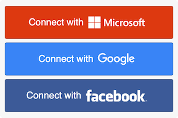

# LogonLabs JavaScript

The official LogonLabs JavaScript client library.
## Download

    https://cdn.logonlabs.com/dist/logonlabs.2.2.min.js
## LogonLabs API


- Prior to coding, some configuration is required at https://logonlabs.com/app/#/app-settings.

- For the full Developer Documentation please visit: https://logonlabs.com/docs/api/

---
### Add LogonLabs to your Login Screen

- Your `APP_ID` can be found in [App Settings](https://logonlabs.com/app/#/app-settings)
- The `LOGONLABS_API_ENDPOINT` should be set to `https://api.logonlabs.com`
 

```html
<!DOCTYPE html>
<html>
  <head>
    <title>LogonLabs Sample</title>
    <style> .logonlabs { width: 300px; } </style>
    <script>
      window.logonAsync = function() {
        LogonClient.configure({ 
            app_id: '{APP_ID}', 
            api_path: '{LOGONLABS_API_ENDPOINT}' 
        });
        LogonClient.ui.button('logonlabs-buttons');
        LogonClient.ui.button('logonlabs-icons', {theme: 'icon'});
      };
    </script>
    <script async defer src="https://cdn.logonlabs.com/dist/logonlabs.min.js"/>
  </head>
  <body>
    <h2>LogonLabs Sample</h2>
    <div id="logonlabs-buttons" class="logonlabs"></div>
    <div id="logonlabs-icons" class="logonlabs"></div>
  </body>
</html>
```
---
### SSO Login QuickStart
The StartLogin function in the JS library begins the LogonLabs managed SSO process.

```javascript
LogonClient.startLogin({
    identity_provider: LogonClient.identityProviders.GOOGLE
});
```
---
### Helper Methods
#### GetProviders
This method is used to retrieve a list of all providers enabled for the application.
If an email address is passed it will further filter any providers available/disabled for the domain of the address.
If any Enterprise Identity Providers have been configured a separate set of matching providers will also be returned in enterprise_identity_providers.
```javascript
LogonClient.getProviders('example@emailaddress.com', (res)=> {
    for(var i = 0; i < res.social_identity_providers.length; i++) {
        //each individual provider available for this app / email address
    }
    for(var i = 0; i < res.enterprise_identity_providers.length; i++) {
        //each enterprise provider available for this app / email address
    }
});
```
---
## JavaScript Only Workflow
The following workflow is required if you're using JavaScript UI components.
### ui.button
Using the following code, the identity providers that you defined for your app will be dynamically added to your login page.
This function will call the providers, which will require to add the CORS whitelist.

```html
<div id="logonlabs-buttons"></div>
```

```javascript
LogonClient.ui.button('logonlabs-buttons', options); //options is not required
```

### Options
Fields | Values 
--- | ---
theme | The button stlyle for the providers. <br>Allow: icon<br> Default: button
pass | The field is allow the ui not adding the event. Allow you to add custom event listener.
email_address | If an email address is passed, it will return the list of providers available for that email domain.
identity_providers | If the fields is set, it will not dynamically call to get the providers

#### Theme
Values | Types
--- | ---
button |  
icon |  

#### Identity Providers
Providers example
```json
[
    {
        "type": "microsoft"
    },
    {
        "type": "google"
    }
]
```

| Identity Provider Lists |
| --- | 
| LogonClient.identityProviders.MICROSOFT | 
| LogonClient.identityProviders.GOOGLE | 
| LogonClient.identityProviders.FACEBOOK | 
| LogonClient.identityProviders.TWITTER | 
| LogonClient.identityProviders.SLACK | 
| LogonClient.identityProviders.LINKEDIN | 
| LogonClient.identityProviders.OKTA | 


#### Pass
When pass is true, you are able to listen to event from `#logonlabs-ui>div`

Example: listening event to add provider to query string 
```javascript
$('#logonlabs-ui>div').on('click', function(res){
    var name = $(res.currentTarget).attr('name');
    var search = document.location.search;
    if (search.indexOf('provider') > -1) {
        search = search.replace(/(provider=)[^\&]+/, '$1' + name);
    } else {
        if (search.length > 0) {
            search += '&';
        } else {
            search += '?';
        }
        search += 'provider=' + name;
    }
    document.location.search = search;
});
```

### UI Format
CSS styles can be apply to the UI providers. Following are the basic format of the UI generated from the script.

#### Buttons
```html
<div id="logonlabs-ui">
    <div name="microsoft">
        <div data-name="microsoft" class="item">
            <span>Connect with</span>
            <svg />
        </div>
    </div>
    <div name="google">
        <div data-name="google" class="item">
            <span>Connect with</span>
            <svg />
        </div>
    </div>
</div>
```

#### Icons
```html
<div id="logonlabs-ui" class="icon">
    <div name="microsoft">
        <div data-name="microsoft" class="item">
            <svg />
        </div>
    </div>
    <div name="google">
        <div data-name="google" class="item">
            <svg />
        </div>
    </div>
</div>
```